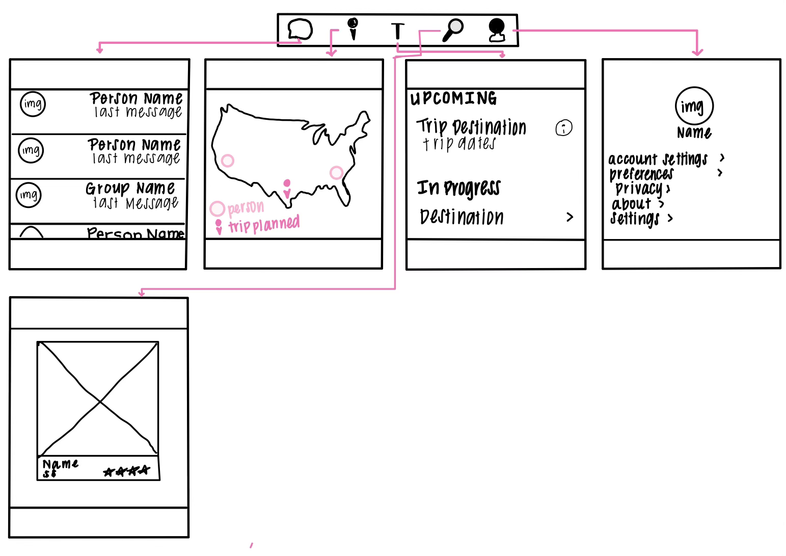
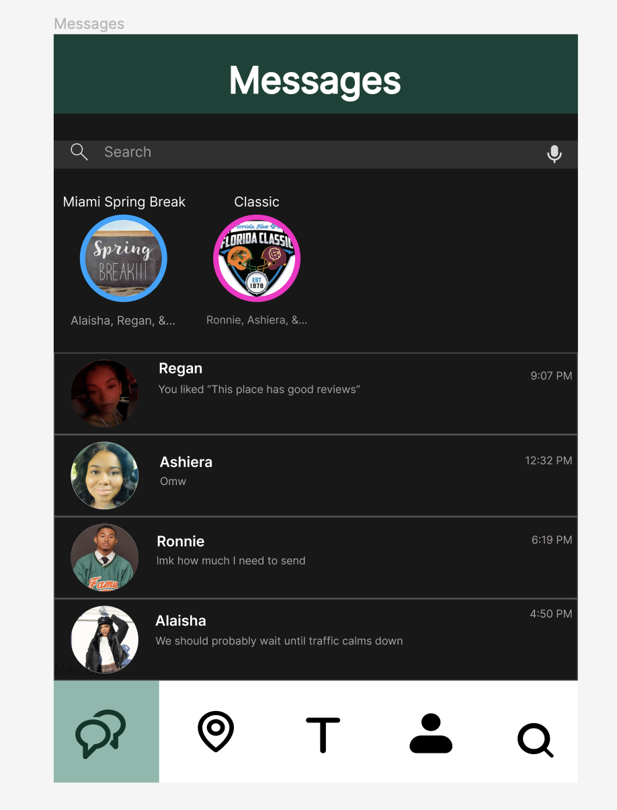
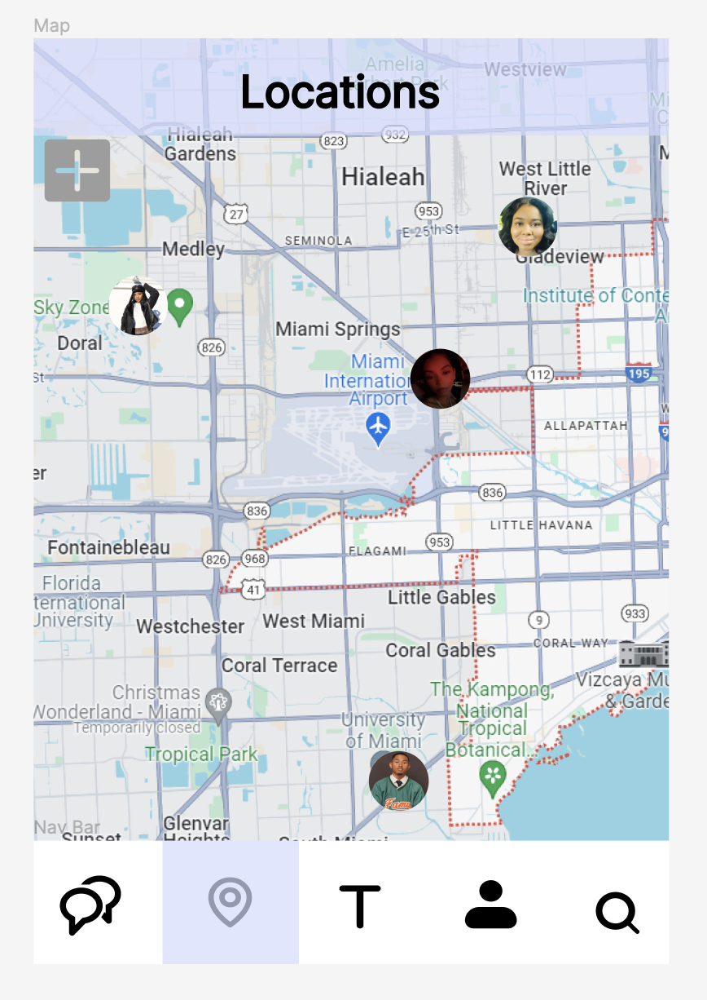
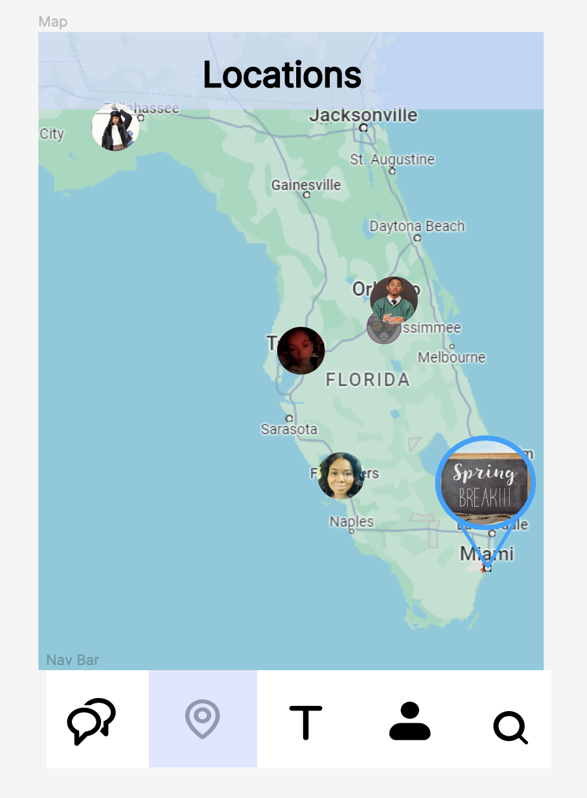
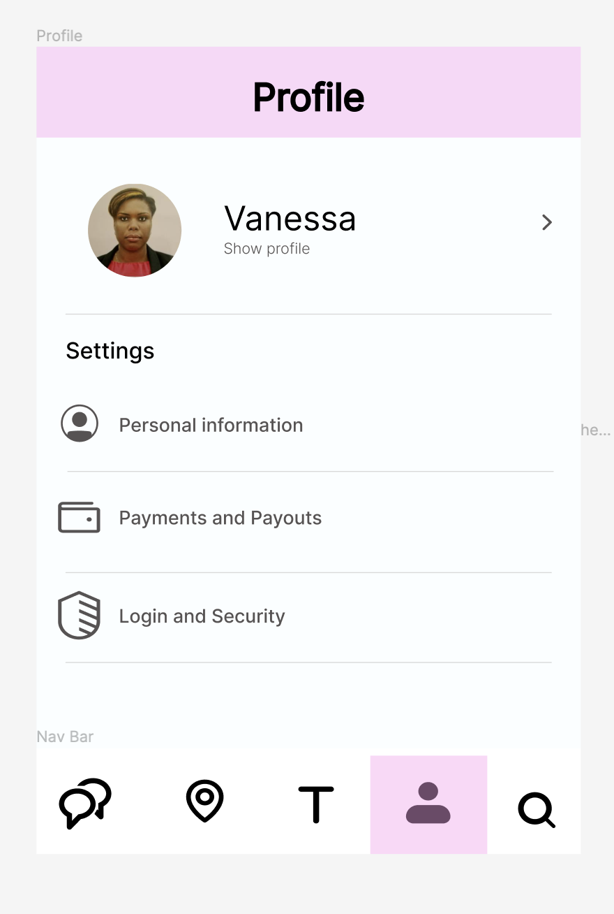

# VoyageSync

# Table of Contents
1.) [Overview](#overview)

2.) [Product Specs](#product-specs) 
  
3.) [WireFrames](#wireframes)

4.) [Schema](#schema)

## Overview
### Description
Allows users to tailor their journey based on their preference and interest for an unforgettable experience. Great for solo, group, and first time travelers. 
### App Evaluation 
- **Category:** Travel
- **Story:** Analyzes user preferences and creates a selection of activities, restaurants, and other excursions the user and/or group will enjoy. The users traveling in a group will be allowed to vote on which they would like to do and a budget will be created for each person to make planning the trip easier.  
- **Market:** Anyone over the [age limit] will be able to use this app as it allows for in-app purchases. In order to keep a safe enviorment, the creater/organizer of the trip will be given an access code to invite people on the trip. This access code will allow users to have access to that trip and only that trip outside of any they create on their own.
- **Habit:** This app can be used often or unoften depending on how long it takes to save money and plan for the trip. The itinerary created via the app can also be used during the trip to allow users to stick to a schedule.
- **Scope:** First, we will start by allowing users to pick their preferences in regards to traveling, then we will allow them the option to make it a group trip or keep it solo. From there, an itinerary will be created that the user can change as they see fit. In a group setting the itinerary will be voted on, anything less then the majority will be placed in a file for the designated person to have on their next itinerary if they visit there again. Based on the itinerary, a budget will be created for how much each person needs to save before purchasing the tickets, making a reservation, etc.. Potential to expand to booking hotels, flights, etc.

## Product Specs
### 1.) User Stories (Required & Optional)
#### Required (Must Have)
- Login / Sign up
- Create a trip
- Travel Preferences / History / Interests
- In-App Messaging
- Itinerary Creation + Voting
- Safety Features: Location Sharing
- Total Cost / Price Tracker
#### Optional (Nice to Have)
- Offline Access
- Integration with Travel Agencies
- Local Event Calendar
- Weather Integration
- Travel Guides
- Language Translator
- Currency Converter
### 2.) Screens
- Login Screen
  - Upon downloading / redownloading the user is prompted to register or log in. If user chooses to log in their account information will be loaded into the application.
- Registration Screen
  - Upon downloading the user is prompted to register or log in to acces the application and their profile information or create a profile.
  - User Preferences (e.g. food, weather / climate, activities, etc.)
  - Safety Features will be included in this process:
    - Location Sharing Enabled/Disabled
    - Emergency Contact Info
- Home "Trips" Screen
  - Upon entering / register / logging in the user is taken to the home page where their "trips" both upcoming and trips they have in progress of planning will be listed. All trips will have the ability to be clicked on to see details about the trip including:
    - Budget / Total Cost of Trip
    - Members of Trip
    - Flight Date(s)
    - Accommodations (Hotels, AirBnBs, etc.)
    - Itinerary
    - Progress of Trip
- Messaging Screen
  - Allows users to chat 1-on-1 or in a group to keep information / converstations about the trip in one place. User is able to create a new direct message to members / friends on their friends list or in the same group. Group trips will automatically create a group chat.
- Map Screen
  - This will allow the users to have the location of their friend list along side seeing the location of the destination of their upcoming trip.
    - If the trip has multiple stops (e.g. Tokyo, Kyoto, Hirsohima) the icon for the trip will move to that location on the start date of that trip.
- Explore "Destinations" Screen
  - This will give the users suggestions of places to visit while in the area for their trip. If the user is not on a trip but planning on it will give suggesstions of places to visit. All suggestions will be based off of preferences
- Profile / Settings Screen
  - This will have application settings, alongside setting for the user. The user will be able to change their image, name, and any contact information. The user will also be able to add / change / delete preferences.
### 3.) Naviagation
#### Tab Navigation 
- Messages
- Maps
- Home
- Explore
- Profile / Settings
#### Flow Navigation
- Login -> Sign Up if no log in is available
- Home "Trips": List of upcoming tips / in progress trips
  - Create new Trip
  - Trip Itinerary 
- Explore: Places the user might be interest in exploring
  - Destinations are clickable with a pop-up screen that shows destination details
    - Create New trip will be a button user can click on destination to create a new trip
- Messages
  - Group Chat Messages will be contain a screen for message thread of all users going on the trip
  - Direct Message will contain private messages between two users
  - Create Direct Message will allow users to choose who they want to message
- Profile / Settings
  - List of options for users to choose from each will display its own content of information on its own screen
- Maps
  - Map of users live location, if user is clicked information about their location will pop up
  - Destination Location, if clicked will show information about the trip
## WireFrames
### Sketch

### Digital Mockup

## Schema
### Models
#### User
|Property|Type|Description|
| :---: | :---: | :---: |
|userID | String |Default Field|
|username | String |user username credentials |
|email | String |user email credentials|
|password | String |user password credentials|
|profileImg | File |user profile image|
|preferences | Array |e.g. food, weather/climate, activites, etc.|
|locationSharingEnabled | Boolean |does the user want to share location|
|emergencyContactInfo | Array |user emergrency contact (name, number, relationship)|
|friendsList | Array |references other **User objects**|
|trips | Array |reference to **Trip objects**|
|notificationSetting | Array |pushNotificationsEnabled: Boolean, inAppNotificationsEnabled: Boolean|

#### Trip
|Property|Type|Description|
| :---: | :---: | :---: |
|tripID | String |Default Field|
|user | Pointer |reference to owner of trip|
|name | String | name of trip|
|budget | Number |budget for trip|
|totalCost | Number |total cost of trip|
|members | Array of pointers |reference to **User objects**|
|startDate| DateTime | start date of trip|
|endDate| DateTime | end date of trip|
|flightDates | Array |reference to **DateTime objects**|
|accommodations | Array |reference to **Accommodation objects**|
|itinerary | Array |reference to **Itinerary objects**|
|progress | String |planning, in progress, completed|

#### Message
|Property|Type|Description|
| :---: | :---: | :---: |
|messageID | String |Default Field|
|sender | reference |reference to **user object** sender of message|
|receiver | reference |reference to **user object** receiver of message|
|content | String |content of the message|
|timestamp | DateTime |when message was sent|
|isRead | Boolean |been read by the recipient|
|notificationSent | Boolean |notification sent to recipient|
|image | File |image or GIF file sent|
|messageType | String |e.d., text, image, GIF, etc.|

#### Accommodation
|Property|Type|Description|
| :---: | :---: | :---: |
|accommodationID | String |Default Field|
|name| String |e.g., hotel name|
|location| String |e.g., address|
|checkInDate| DateTime |Day / Time of check in|
|checkOutDate| DateTime |Day / Time of check out|

#### Itinerary
|Property|Type|Description|
| :---: | :---: | :---: |
|itineraryID | String |Default Field|
|date| DateTime |Day / Time of activity|
|activity| String |e.g., name of activity|
|location| String |e.g., name of place|
|notes| String | optional| 

### Networking
- Authenication Services: Firebase Authentication
- Backend Database : Firebase Realtime Database
- Messaging: Firebase Cloud Messaging (FCM)
- Map: Google Maps SDK
- Location Sharing: Device Location Service
- Other: Backend Service to fetch and update data
